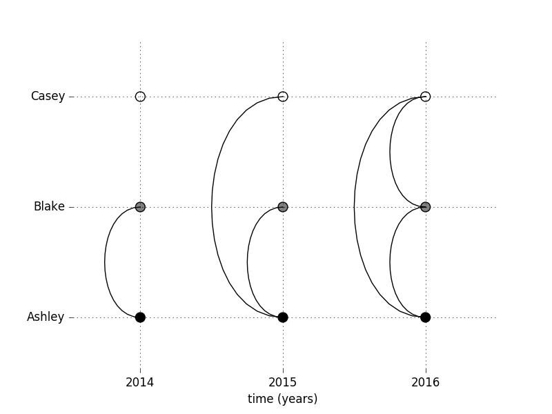
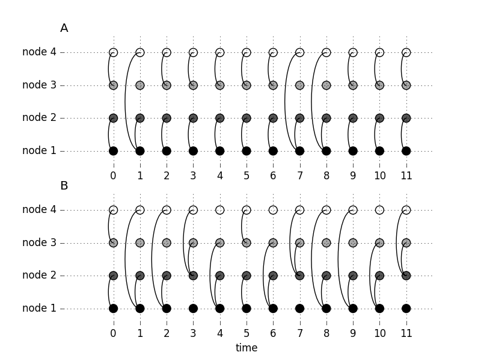
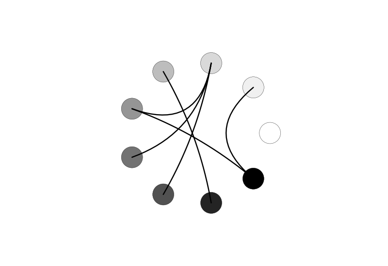

# teneto
**Te**mporal **Ne**twork **To**ols - by William Hedley (wiheto)

## What is here? 

At the moment only one plotting tool to create temporal networks. The first version with functions for temporal networks will be released in November 2016. 


Roadmap: 

- [x] V0.1 - basic plotting tools
- [ ] V0.2 - basic metrics (November 2016). From static to temporal network paper. 
- [ ] V0.3 - full integration with niilearn, nibabel and networkx (January 2017)
- [ ] V0.4 - comprehensive functions and tutorials (Spring 2017)
- [ ] V1.0 - teneto data class creation. Pip integration. (Summer 2017)


## Slice Plots 

Slice plots (pending better name) are useful at showing connections between small number of nodes and time-points. I have made some of these in the past and usually made them by hand (which takes time). So I made this tool using [Bézier curves](https://en.wikipedia.org/wiki/B%C3%A9zier_curve) to make the plots. Each point on the x-axis is a time-point. And each point on the y-axis is a node. Edges are drawn between nodes at a time-point indicating a connection at the time (it is possible to add Bézier lines between nodes of different time points, if you wish (they look cool, I just don't know when they will be useful)).

In the following exmaples, I'll explain why this is useful. 

### Example 1: friends

Taken from ex1.py. First off some importing of necessary stuff. 

In this example the aim is to show what information temporal network theory tries to capture and also show it on a plot. 

Scenario: Ashley were friends with Blake in 2014. Ashley becomes friends with in 2015. Blake and Casey meet (possibly through Ashley) and become friends in 2016. In standard graph theory this would be presented as a connectivity matrix with all three people (nodes) connected. 

|              | **Ashley** | **Blake** | **Casey** |
| --- | --- | --- | ---
| **Ashley** | -    | 1   | 1 |
| **Blake**  | 1   | -   | 1 |
| **Casey**   | 1   |   1  | - |

However the temporal infomration for this is lost. This is where having edges contexualized to time points is useful. 

```
import numpy as np
import slice_graph as sg
import matplotlib.pyplot as plt
```

Then create a 3D matrix of the shape node x node x time. 

```
#Creat the 3d matrix following the scenario given above
A=np.zeros((3,3,3))
A[0,1,:]=1
A[0,2,1:]=1
A[1,2,2]=1
```

Create the edge list. This is simply convert the easier to raw 3d connectivity matrix (usually how the data will be constructed) and makes it a list of tuples of connections. 

```
edgeList = sg.edgeListFromMatrix(A)
```

Then with the edle list we can use sg.plot_slice to plot. 

```
timeLabs=['2014','2015','2016']
nodeLabs=['Ashley','Blake','Casey']
plt.rcParams['image.cmap'] = 'gist_gray' #Gray colour scale (obviously anything is possible)
fig, ax = plt.subplots(1,1)
ax = sg.plot_slice(nodeLabs,timeLabs,ax,edgeList)
ax.set_xlabel('time (years)')
fig.show()
```
This will generate the figure below: 



Here we see graphs connecting by Bézier curves (admittingly I took some of the functions for this from the plot.ly doccumentation).

### Example 2: different dynamics in the temporal networks



## Circle plots

While not strictly necesarily part of temporal network theory, a good circle plotting tool is good to have. From my experience they are usually embedded in graph software and not very accessible/customable. At the moment it can only create the node placement and curves. Plotting the labels automatically is next. 



## This is just some basic plotting. Whats coming up next? 

Metrics for temporal network theory. 
