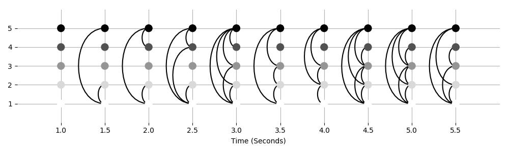
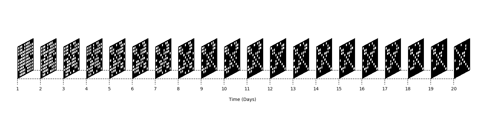

Creating temporal networks
--------------------------

Conceptual introduction
========================

Most often real data is used with teneto. However, there may be times when simulated networks are needed. This tutorial shows how to create a network manually 
and how to use the teneto.generatenetwork module. 

Manually creating networks in teneto 
=====================================

The simplest way to make a network is to make 3D numpy array. First we need to import dependencies. 

.. code-block:: python

  >>> import teneto
  >>> import numpy as np
  >>> import matplotlib.pyplot as plt

Create 3D connectivity matrix in numpy
~~~~~~~~~~~~~~~~~~~~~~~~~~~~~~~~~~~~~~~

.. code-block:: python

  >>> #Number of nodes
  >>> N = 3
  >>> #Number of time points
  >>> T = 5
  >>> connectionspresent = np.array([[0,1,0],[0,2,0],[0,2,1],[0,2,2],[1,2,2]])
  >>> G = np.zeros([N,N,T])
  >>> G[connectionspresent[:,0],connectionspresent[:,1],connectionspresent[:,2]] = 1

Obviously tedious to define every edge and will usually be predefined. So can be imported from numpy.load. With the 3D numpy array it can then be used with all of teneto's functions

Create contact sequency representaiton  
~~~~~~~~~~~~~~~~~~~~~~~~~~~~~~~~~~~~~~~

.. code-block:: python

  >>> params={}
  >>> params['timeunit'] = 'Years'
  >>> C = teneto.utils.graphlet2contact(G,params)

Here different arguments can be placed in the params dictionary which stores information about the network.

Generating a matrix from teneto.generatenetwork
===============================================

Instead of manually specifying networks. It can be useful to generate networks. 
At the moment there is only one function to generate networks (binary only) but more network generation functions will be created with time.

In the teneto.generatenetwork.rand_binomial each connection is determined based on a binomial distribution. 
It takes two necessary inputs: size of network and probaability of connection. Additional inputs such as whether the output shouldbe graphlet or contact and if the network should be directed or undirected. Each edge is determined independently of all others (i.e. if p=0.5 each each has a 50% chance of being possible).

.. code-block:: python

  >>> np.random.seed(2017) # For reproduceability
  >>> # Number of nodes
  >>> N = 3
  >>> # Number of timepoints
  >>> T = 5
  >>> # Probability of edge activation
  >>> p = 0.5
  >>> C1 = teneto.generatenetwork.rand_binomial([N,N,T],p,'contact','bu')

It is also possible to add network information for contact representation which then carries through to plotting funcitons. This is done by giving a dictionary to the netinfo argument.

.. code-block:: python

  >>> np.random.seed(2017) # For reproduceability
  >>> # Number of nodes
  >>> N = 3
  >>> # Number of timepoints
  >>> T = 5
  >>> # Probability of edge activation
  >>> p = 0.5
  >>> # Specify network information
  >>> cfg={}
  >>> cfg['timeunit']='Seconds'
  >>> cfg['Fs']=0.2
  >>> #Generate network
  >>> C2 = teneto.generatenetwork.rand_binomial([N,N,T],p,'contact','bu',netinfo=cfg)

Let's visualize the networks that we have just visualized. 

.. code-block:: python

  >>> # Create matplotlib figure
  >>> fig,ax = plt.subplots(figsize=(10,3))
  >>> ax = plt.subplot(1,1,1)
  >>> ax = teneto.plot.graphlet_stack_plot(C2,ax,q=10,cmap='Reds')

Which produces the following figure: 

.. image:: images/gennet_example1.png
    :align: center

To make the networks a little more complex, the probabailities of rand_binomial can be set so differently for edges that have previously been active. 
Instead of passing a single integer to p, you can pass a list of 2 values. 
The first value is the probabililty for edges who, at t-1=0 will be active at t (is sometimes called the birth-rate). 
The second value is the probabaility of edges who, at t-1=1 will be active at t (sometimes called the death-rate). 
The latter value helps create an autocorrelation.

.. code-block:: python

  >>> np.random.seed(2017) # For reproduceability
  >>> # Number of nodes
  >>> N = 5
  >>> # Number of timepoints
  >>> T = 10
  >>> # Probability of edge activation
  >>> p0to1 = .25
  >>> p1to1 = 0.75
  >>> # Specify network information
  >>> cfg={}
  >>> cfg['timeunit']='Seconds'
  >>> cfg['Fs']=0.5
  >>> #Generate network
  >>> C3 = teneto.generatenetwork.rand_binomial([N,N,T],[p0to1,p1to1],'contact','bu',netinfo=cfg,)

Displaying the network

.. code-block:: python

  >>> import matplotlib.pyplot as plt
  >>> # Create matplotlib figure
  >>> fig,ax = plt.subplots(figsize=(10,3))
  >>> ax = teneto.plot.slice_plot(C3,ax,cmap='Greys')
  >>> fig.tight_layout()

Which produces the following figure: 

This flexibility allows for the creation of different types of networks. 
For example, let us say that, once connected, a connection cannot be lost. Then p1to1=1 and edges can only increase.

As can be seen in the plot above, at the first time-point, all edges are 0. 
This may not be what we want. An alternative is to change the arugment initialize. 
This is the percentage of nodes that should be active at the first time-point. This is set in the example below.

.. code-block:: python

  >>> np.random.seed(2017) # For reproduceability
  >>> # Number of nodes
  >>> N = 10
  >>> # Number of timepoints
  >>> T = 20
  >>> # Probability of edge activation
  >>> p0to1 = .1
  >>> p1to1 = 1
  >>> # Percentage of nodes active at time index 0.
  >>> initialize = 0.1 
  >>> # Specify network information
  >>> cfg={}
  >>> cfg['timeunit']='Days'
  >>> cfg['Fs']=1
  >>> #Generate network
  >>> C4 = teneto.generatenetwork.rand_binomial([N,N,T],[p0to1,p1to1],'contact','bu',netinfo=cfg,initialize=initialize)

Displaying the network

.. code-block:: python

  >>> # Create matplotlib figure
  >>> fig,ax = plt.subplots(figsize=(15,4))
  >>> ax = teneto.plot.graphlet_stack_plot(C4,ax,q=10,cmap='Greys')
  >>> fig.tight_layout()

Which produces the following figure: 

If we instead set p0to1=1 we will make sure that a node never has two consecutive activations. Despite this flexibility, the possibilities of generating networks are still a little limitted. Additional generating tools will be added in later versions.
