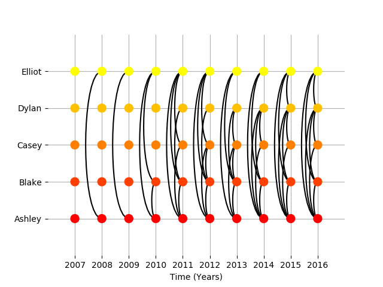
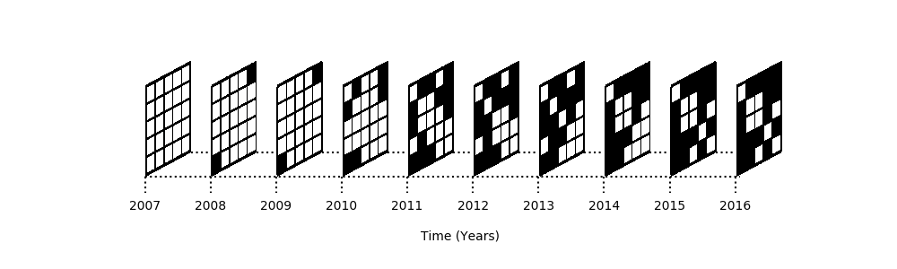
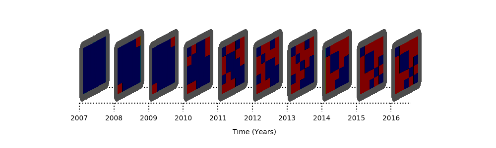

Plotting temporal networks
--------------------------

Plotting in teneto
==================

Being able to view the network information through time is very useful. Teneto offers two solutions that help convey an overview of temporal networks. These functions are clearer when the networks are smaller.

For the example, first we'll start by generating a network to visualize.

.. code-block:: python

  >>> import teneto
  >>> import numpy as np
  >>> import matplotlib.pyplot as plt
  >>> #Set colourmap
  >>> plt.rcParams['image.cmap'] = 'autumn'

Then we need to generate a binary undirected network to work with.
Here we have 5 nodes over 10 time points
(see the tutorial/generating_a_random_network example for more information)

.. code-block:: python

  >>> np.random.seed(2017) # For reproduceability
  >>> # Number of nodes
  >>> N = 5
  >>> # Number of timepoints
  >>> T = 10
  >>> # Probability of edge activation
  >>> p0to1 = 0.2
  >>> p1to1 = .9
  >>> # Add node names into the network and say time units are years, go 1 year per graphlet and startyear is 2007
  >>> cfg={}
  >>> cfg['Fs'] = 1
  >>> cfg['timeunit'] = 'Years'
  >>> cfg['nodelabels'] = ['Ashley','Blake','Casey','Dylan','Elliot']
  >>> cfg['t0'] = 2007 #First year in network
  >>> #Generate network
  >>> C = teneto.generatenetwork.rand_binomial([N,N,T],[p0to1, p1to1],'contact','bu',netinfo=cfg)

Slice plots
================

Plotting tools are found in teneto.plot module. Slice_plot's line up all the nodes for a time point into a "slice". Each edge is plotted with a curved line.

.. code-block:: python

  >>> fig,ax = plt.subplots()
  >>> ax = plt.subplot(1,1,1)
  >>> ax = teneto.plot.slice_plot(C,ax)

This will produce the following figure:

Graphlet stack plots
======================

Graphlet stack plots takes the temporal network input and automatically scales each 2D adjacency matrix, creating a 3D effect, and stacks them up in a time series.

With only the generated network above (C), we then create a matplotlib figure and then call graphlet_stack_plot.

.. code-block:: python

  >>> # Create matplotlib figure
  >>> fig,ax = plt.subplots(figsize=(10,3))
  >>> ax = plt.subplot(1,1,1)
  >>> colorMap = 'Greys'
  >>> # Only new parameter is "q" which stands for figure quality
  >>> ax = teneto.plot.graphlet_stack_plot(C,ax,q=10,cmap=colorMap)

The argument q stands for figure quality. A higher number exports a higher figure. While the figure can be exported as a svg (and figure labels can be changed), the graphlet stack itself is a bitmap due to how it is created.

This will produce the following figure:

Customizing graphlet_stack_plot
===============================

There are some possibilities to modify graphlet_stack_plot after ones own style instead of the default plot.

Below we see an example of customization by: removing the grids between edge values, changing the border colour to a grey and making the border much larger. This isn't pretty, but shows what can be done.

There are still a couple of restrictions. At the moment some border must be present. As too are the rounded rectangles border.

.. code-block:: python

  >>> # Create matplotlib figure
  >>> fig,ax = plt.subplots(figsize=(10,3))
  >>> ax = plt.subplot(1,1,1)
  >>> colorMap = 'seismic'
  >>> # Call graphlet_stack_plot adding only specified parameters.
  >>> ax = teneto.plot.graphlet_stack_plot(C,ax,q=10,cmap=colorMap,gridcolor='none',borderwidth=12,bordercolor=[.3,.3,.3])

This will produce the following figure:

